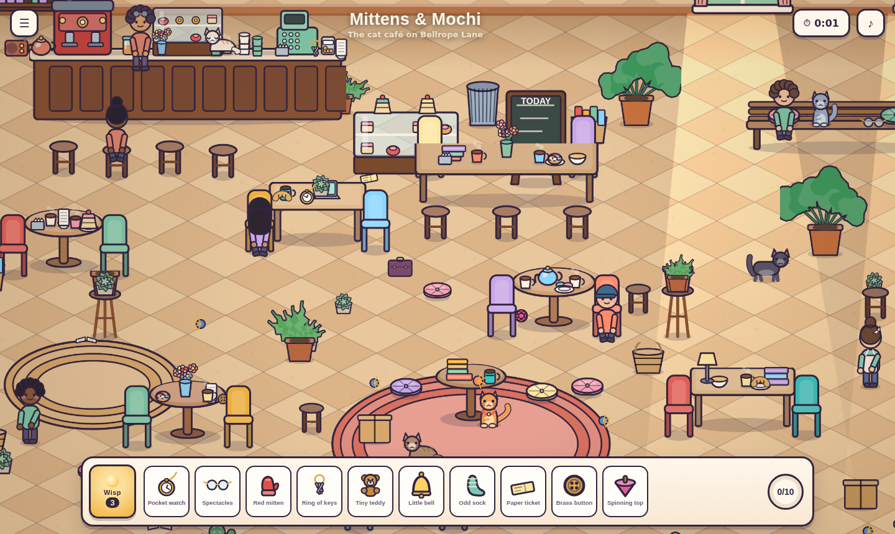

# Odds & Endings — a cozy lost & found

A small interactive 2D world in the spirit of *Lost and Found Co.*: three dense,
hand-drawn scenes you pan and zoom around, hunting for the things people
dropped. Bold outlines, flat vibrant colour, a lot of clutter, and cats.

No engine, no sprite sheets, no build step. Every table, fern, lantern and cat
is drawn with Canvas 2D paths at runtime, so the art stays crisp at any zoom
and the whole game is about 200 kB of source.



## Play

```bash
npm install     # only needed for the test tooling
npm start       # serves on http://localhost:8080
```

ES modules need a real server, so opening `index.html` from the filesystem
won't work — use `npm start`, or any static server.

## How it plays

Ten lost items are hidden in each scene. Find them all before you run out of
patience; the shop has no closing time.

| | |
|---|---|
| **drag** | look around |
| **scroll / pinch** | zoom |
| **click / tap** | pick something up |
| **Wisp** (or `H`) | spend one of three hints — it circles something you missed |
| **Esc** | pause |

Poking at the world is half the point. Cats blink, loaf, and meow when you
click them. People have things to say. The radio behind the counter plays.
Everything you recover is catalogued on **the shelf**, which fills up across
all three levels.

### The scenes

| Scene | |
|---|---|
| **Mittens & Mochi** | The cat café on Bellrope Lane, at closing time |
| **Lantern Row** | A night market in its last hour of trading |
| **Fernbell Glasshouse** | Under the glass, after the rain |

## How it is put together

```
index.html            the shell: a canvas plus the DOM HUD
src/
  core/               engine bits, no game knowledge
    draw.js           outlined-shape primitives, colour maths, cached gradients
    camera.js         pan/zoom with clamping and eased scripted moves
    input.js          drag-to-pan, pinch zoom, and a tap that isn't a drag
    particles.js      sparkles, confetti, ambience
    audio.js          a small WebAudio synth — every sound is an oscillator
    rng.js            seeded RNG, so scattered clutter is identical every load
    store.js          localStorage that never throws
  art/
    palette.js        the shared colours and per-scene moods
    props-core.js     furniture, fittings, containers, lights
    props-small.js    tabletop clutter: food, drink, stationery
    props-nature.js   plants and water
    props-finds.js    the 30 findable items
    characters.js     cats, people, butterflies
    props.js          the merged registry, icon renderer, sprite-liveness set
  scenes/
    backdrops.js      the painted rooms: tiles, cobbles, glazing bars
    cafe.js           \
    market.js          } level layouts
    greenhouse.js     /
  game/
    scene.js          authoring API + runtime (sorting, culling, hit-testing)
    state.js          level flow, find/hint rules, progress
  ui/                 HUD, speech bubbles, overlay cards
```

### Things worth knowing if you poke at the code

**Projection.** Props are placed in screen space and depth-sorted by `y`; the
diorama feel comes from how each prop is *drawn* (squashed top faces, elliptical
shadows) and from the tiled floors. Placing things is therefore just picking
coordinates, and `sort` overrides the depth key when something sits on a table.

**Surfaces.** Each scene file declares the surface height of its furniture
(`ROUND`, `COUNTER`, `BENCH`…) and places tabletop clutter through `put()`, so
cups sit *on* tables instead of hovering behind them.

**Foliage silhouettes.** `draw.group()` strokes every blob of a bush first and
then fills them all, so the fills bury the interior outlines and the plant reads
as one leafy mass. Leaf geometry is cached as `Path2D` and placed by transform.

**Sprite baking.** Zoomed out, every prop is on screen at once. Below a zoom
threshold each static prop is baked once into a sprite at a resolution at least
as fine as the screen — the blit is pixel-exact, not blurry — and above it the
paths are drawn live again, when far fewer props are in view. Roughly doubles
the frame rate on software rasterisation.

**HUD keep-out.** The camera never scrolls past the world edge, so the bottom
strip of the world always sits under the dock. `npm run check` enforces that no
findable item lives there, and that nothing is drawn on top of one.

## Tooling

```bash
npm start            # dev server
npm run check        # every hidden object is reachable and unobscured
npm test             # headless playthrough: clicks all 30 items, checks the flow
npm run shots        # screenshots each scene to shots/
npm run build:artifact
```

`npm test` and `npm run shots` need the dev server running.
